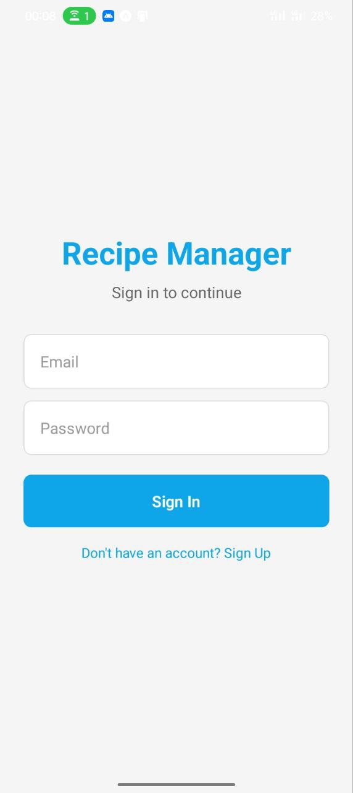
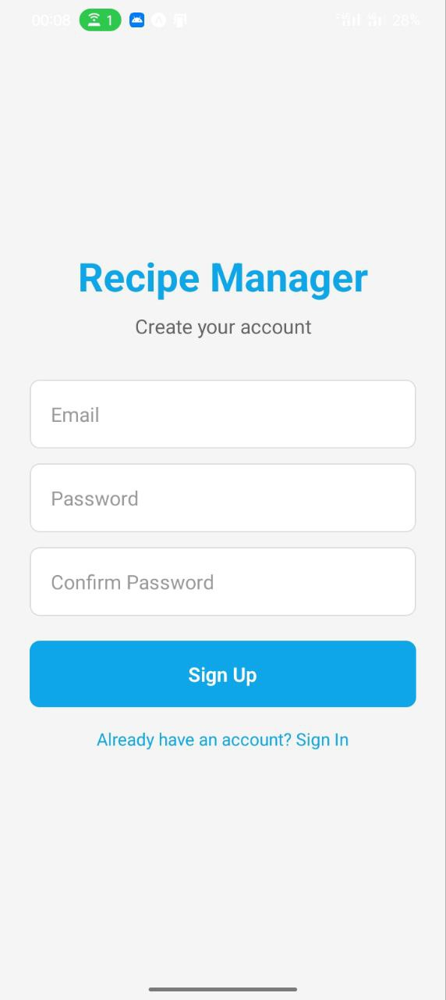
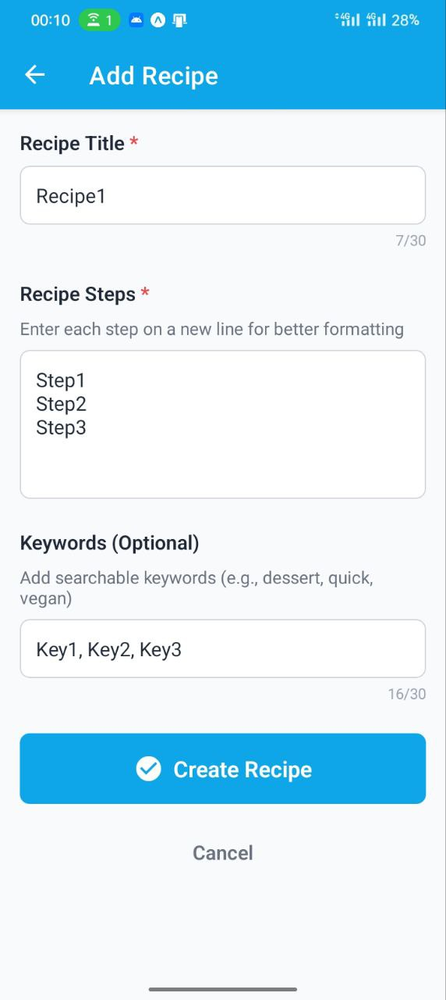
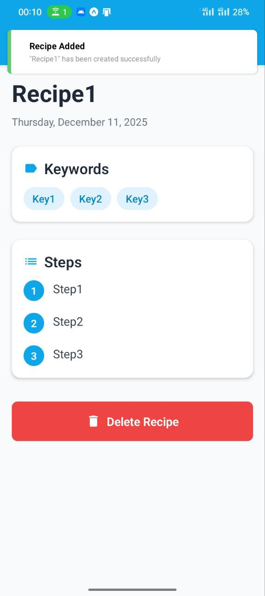
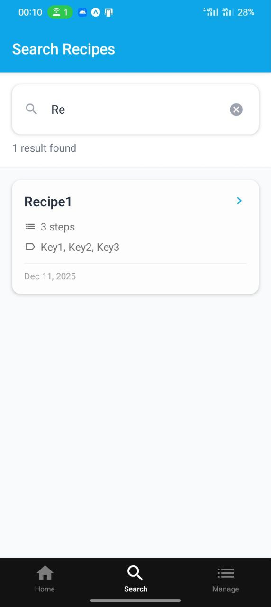
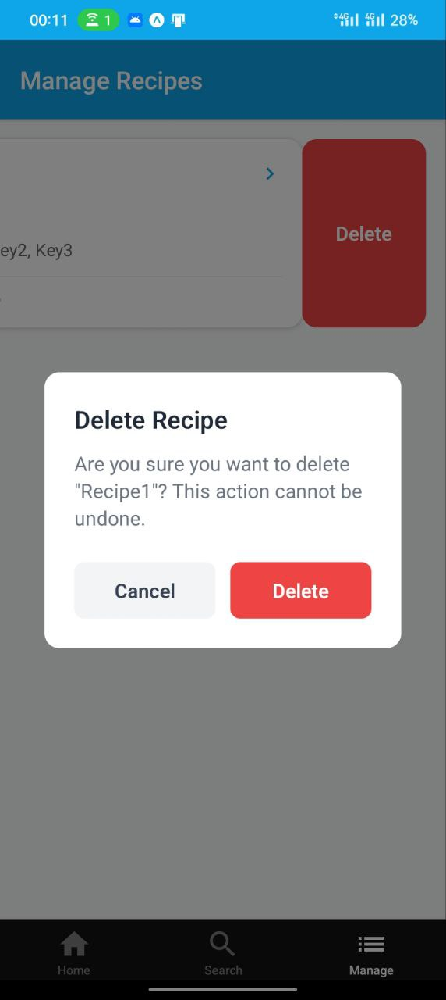
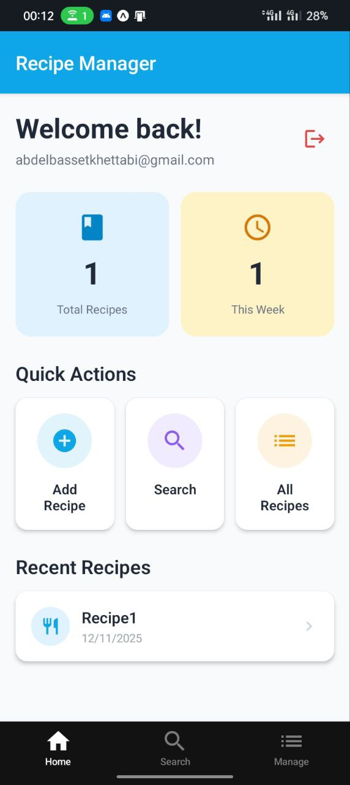

# Recipe Manager - React Native Mobile App

A professional recipe management mobile application built with React Native (Expo) and Supabase PostgreSQL backend. Create, search, and manage your personal recipe collection with a beautiful, intuitive interface.

## 🌟 Features

- **User Authentication** - Secure email/password authentication with Supabase Auth
- **Recipe Management** - Create, read, update, and delete recipes
- **Real-time Search** - Search recipes by title or keywords with debouncing
- **Swipe to Delete** - Intuitive gesture-based recipe deletion
- **Pull to Refresh** - Keep your recipe list up to date
- **Responsive Design** - Beautiful UI with smooth animations
- **Cloud Sync** - All recipes stored securely in Supabase PostgreSQL
- **Row-Level Security** - Users can only access their own recipes

## 📱 Screens

1. **Home Screen** - Dashboard with recipe statistics and quick actions
2. **Search Screen** - Real-time recipe search functionality
3. **Manage Screen** - List all recipes with swipe-to-delete
4. **Add Recipe Screen** - Create new recipes with validated form
5. **Recipe Detail Screen** - View complete recipe information

## 📸 Screenshots

<div align="center">
  
  
  
</div>

<div align="center">
  
  
  
</div>

<div align="center">
  
</div>

## 🛠 Tech Stack

- **Frontend**: React Native with Expo SDK 54
- **Language**: TypeScript
- **Backend**: Supabase (PostgreSQL)
- **Navigation**: Expo Router
- **Animations**: React Native Reanimated
- **State Management**: React Context API + Custom Hooks
- **Notifications**: react-native-toast-message

## 📋 Prerequisites

- Node.js (v18 or higher)
- npm or yarn
- Supabase account ([supabase.com](https://supabase.com))
- iOS Simulator (Mac) or Android Emulator or Expo Go app

## 🚀 Setup Instructions

### 1. Install Dependencies

```bash
npm install
```

### 2. Supabase Setup

#### Create Supabase Project
1. Go to [supabase.com](https://supabase.com) and create a new project
2. Wait for the project to be fully provisioned

#### Create Database Schema
Run this SQL in your Supabase SQL Editor:

```sql
-- Create recipes table
CREATE TABLE recipes (
  id UUID DEFAULT gen_random_uuid() PRIMARY KEY,
  title VARCHAR(30) NOT NULL,
  steps TEXT NOT NULL,
  keywords VARCHAR(30),
  created_at TIMESTAMP WITH TIME ZONE DEFAULT NOW(),
  user_id UUID NOT NULL REFERENCES auth.users(id) ON DELETE CASCADE
);

-- Enable Row Level Security
ALTER TABLE recipes ENABLE ROW LEVEL SECURITY;

-- Create RLS Policies
CREATE POLICY "Users can read own recipes"
  ON recipes FOR SELECT USING (auth.uid() = user_id);

CREATE POLICY "Users can insert own recipes"
  ON recipes FOR INSERT WITH CHECK (auth.uid() = user_id);

CREATE POLICY "Users can update own recipes"
  ON recipes FOR UPDATE USING (auth.uid() = user_id);

CREATE POLICY "Users can delete own recipes"
  ON recipes FOR DELETE USING (auth.uid() = user_id);

-- Create indexes for search performance
CREATE INDEX idx_recipes_title ON recipes(title);
CREATE INDEX idx_recipes_keywords ON recipes(keywords);
CREATE INDEX idx_recipes_user_id ON recipes(user_id);
```

### 3. Environment Variables

Copy `.env.example` to `.env` and add your Supabase credentials:

```env
EXPO_PUBLIC_SUPABASE_URL=https://your-project.supabase.co
EXPO_PUBLIC_SUPABASE_ANON_KEY=your-anon-key-here
```

Find these in: Supabase Dashboard → Settings → API

### 4. Run the App

```bash
npm start       # Start dev server
npm run ios     # Run on iOS
npm run android # Run on Android
```

## 📝 Database Schema

```typescript
interface Recipe {
  id: string;              // UUID, auto-generated
  title: string;           // VARCHAR(30), required
  steps: string;           // TEXT, required
  keywords: string | null; // VARCHAR(30), optional
  created_at: string;      // TIMESTAMP, auto-generated
  user_id: string;         // UUID, references auth.users
}
```

## 📁 Project Structure

```
tp7/
├── app/                    # Expo Router screens
│   ├── (tabs)/            # Tab navigation
│   │   ├── index.tsx      # Home
│   │   ├── search.tsx     # Search
│   │   └── manage.tsx     # Manage
│   ├── recipe/[id].tsx    # Recipe detail
│   └── add-recipe.tsx     # Add recipe
├── src/
│   ├── components/        # Reusable components
│   ├── contexts/          # Auth context
│   ├── hooks/             # Custom hooks
│   ├── lib/               # Supabase config
│   ├── screens/           # Auth screen
│   └── types/             # TypeScript types
└── .env                   # Environment variables
```

## 🔒 Security

- Row-Level Security (RLS) enabled
- Users can only access their own recipes
- Authentication required for all operations
- Environment variables for sensitive data

## 🐛 Troubleshooting

**"Missing Supabase environment variables"**
- Ensure `.env` file exists with correct credentials
- Restart Expo dev server

**"Failed to fetch recipes"**
- Check internet connection
- Verify Supabase project is active
- Check RLS policies are created

## 📚 Resources

- [Expo Documentation](https://docs.expo.dev/)
- [Supabase Documentation](https://supabase.com/docs)
- [React Native](https://reactnative.dev/)
- [Expo Router](https://docs.expo.dev/router/introduction/)

---

**Happy Cooking! 🍳**
